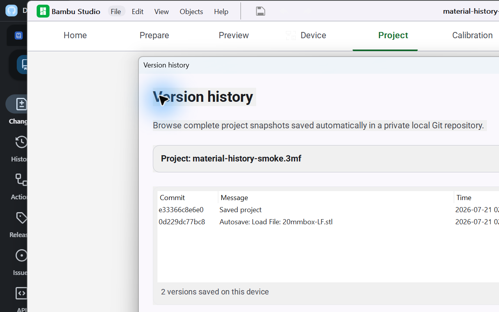

# BambuStudio
Bambu Studio is a cutting-edge, feature-rich slicing software.  
It contains project-based workflows, systematically optimized slicing algorithms, and an easy-to-use graphic interface, bringing users an incredibly smooth printing experience.

This fork's maintained delivery target is native Windows UI modernization informed by Material Design 3. The
[latest Windows installer](https://github.com/Ding-Ding-Projects/BambuStudio/releases/latest/download/BambuStudioMD3-Setup.exe)
is a per-user install and does not require administrator elevation. It is currently unsigned; verify
the accompanying
[SHA-256 file](https://github.com/Ding-Ding-Projects/BambuStudio/releases/latest/download/BambuStudioMD3-Setup.exe.sha256)
before running it. Upstream cross-platform releases remain available from
[Bambu Lab](https://github.com/bambulab/BambuStudio/releases/), but macOS and Linux are outside this
fork's release acceptance gate.

The Windows UI provides three canonical fork modes: English (`en`), playful Hong Kong Cantonese
preview (`yue_HK`), and compact English + Cantonese preview (`bilingual_en_yue_HK`). Existing Bambu Studio
locales remain available. Missing Cantonese copy falls back to English; native bilingual presentation
is opt-in on migrated surfaces, and the Cantonese catalog remains a curated preview pending broader
human review. See the
[language-mode documentation](docs/features/windows/language-modes.md) for coverage and fallback
details.

## Native UI modernization (Material Design 3)

The production wxWidgets application now consumes the vendored Material Design 3 design system
end-to-end. The canonical in-repo design source is [`ui-md3/design-system/`](ui-md3/design-system/);
its token values match `src/slic3r/GUI/Widgets/MD3Tokens.hpp` exactly, and the native code resolves
colors through semantic tokens instead of hardcoded hexes. A ground-up migration converted theme
colors and fonts across essentially the whole GUI tree (roughly 120 files over six waves), backed by
Roboto and Roboto Mono shipped as application resources. Contextual schemes are resolved per
workspace: brand green for Prepare and general UI, Preview purple for the G-code preview, and Device
teal for the printer surfaces. Functional data colors (filament swatches, G-code feature colors, 3D
paint palettes) are deliberately preserved.

Beyond the token layer, an element-by-element conformance register
([`docs/features/design-system/md3-parity-register.md`](docs/features/design-system/md3-parity-register.md))
drove nine implementation waves of structural component anatomy. As of 2026-07-22 the register
stands at **120 rows done, 4 recorded deviations** (each documented with concrete evidence in the
register), **and 5 open rows** — the deep Prepare-sidebar rebuilds (printer identity card, bed
field, filament info-rows, Process card, Objects card) — which are being finished in a concurrent
implementation wave. Landed anatomy includes the Material Symbols icon font and ImGui glyph atlas,
the rebuilt shared widget kit, the `MD3Dialog` shell with the MessageDialog family and the
raw-`wxMessageBox` sweep, the kit title bar, the Preferences NavRail with runtime density/accent
controls, the device camera HUD and card grid, the Preview timeline transport bar, and the
glyph-to-GL-texture bridge for the 3D toolbar and gizmo rail. The register itself is the live
tracker; counts above are as of this writing.

Two native features were added in the same effort:

- A native OpenGL model preview for the MakerWorld "Download and Open" flow shows an interactive
  orbit/zoom/fit view before import, with **Open in Prepare** and **Close** actions and a
  failure-safe fallback to the normal import. See
  [MakerWorld OpenGL preview](docs/features/model-preview/makerworld-opengl-preview.md).
- A dockable Prepare sidebar can be docked left, right, top, or bottom (default left) and re-docks
  live from a Preferences control. See
  [Dockable Prepare sidebar](docs/features/prepare/dockable-sidebar.md).

Full documentation of the token layer, migration, failure modes, and audit result is in
[Vendored Material Design 3 design system](docs/features/design-system/md3-design-system.md).

### Installed-app captures

These are captures of the locally installed native executable, not `ui-md3` reference images. They
were reviewed on 2026-07-20 and predate the full token sweep, so they demonstrate native
modernization only, not full component-anatomy conformance. Fresh captures of the fully migrated
Home, Prepare, Preview, and Device surfaces are an open item tracked in the
[roadmap](ROADMAP.md), which records the canonical target filenames; this gallery switches to
those captures once they are produced and reviewed.

| Home | Filament Manager |
| :---: | :---: |
|  |  |

| Device boundary | Project Version History |
| :---: | :---: |
|  |  |

### Interactive design reference

The images below are deterministic captures of the separate [`ui-md3`](ui-md3/) interactive design
reference, not screenshots of the native application. Select an image to open the same reference
screen, theme, density, accent, and language state. The installed-app captures are the separate
gallery above.

**Prepare · light theme · English**

| Preview · dark theme · Hong Kong Cantonese | Device · compact dark theme · English + Cantonese |
| :---: | :---: |
|  |  |

## Windows installer

The NSIS installer is restyled to Material Design 3: custom Welcome, language, install-source,
build-progress, and Finish pages, with the unavoidable Win32 dialog deviations recorded in the
installer documentation, and a root-cause fix for the previously garbled Cantonese language page
(UTF-8 sources compiled with `/INPUTCHARSET UTF8`). Alongside the default prebuilt install, an
optional interactive **Build from source** mode bootstraps Git, Node.js LTS, the Visual Studio 2022
C++ Build Tools, and CMake, clones this repository at the release tag, compiles it locally with a
bounded five-cycle automated repair loop, and hands the built payload to the same ownership,
recovery, and uninstall flow as the prebuilt path. Build from source is never reachable in silent
mode and never runs in CI; its first end-to-end run on a real machine is still an open verification
item. See [Native Windows installer](docs/features/releases/windows-native-installer.md) and
[Build from source](docs/features/releases/windows-build-from-source.md).

## Project history

The native app includes app-local, Git-backed version history for `.3mf` projects. Each retained
revision is a complete project snapshot in an isolated bare repository below Bambu Studio's data
directory, never a `.git` directory beside the user's project. Automatic edits and completed manual
saves are queued in order; identical snapshots are suppressed. **File → Version history** lists and
restores revisions without directly overwriting the saved project, and **Save As** forks the existing
history to the new project identity when it is safe to do so.

History is local to this device: it is not pushed to the source-code repository, synced to another
computer, or a replacement for backups. There is not yet a retention or pruning policy, so storage
can grow with project size and edit count. A restore changes the open session; the project file is
only replaced when the user explicitly saves it.

The Windows pipeline builds and tests the native application, exercises installer upgrade
and recovery behavior on a disposable GitHub-hosted runner, produces a per-file CycloneDX 1.6 SBOM,
and creates GitHub provenance and SBOM attestations for the installer. It validates all three assets
in a draft before publication and refuses to publish unless repository immutable releases are
enabled. The publish pipeline is verified green: hosted run
[`29877040307`](https://github.com/Ding-Ding-Projects/BambuStudio/actions/runs/29877040307)
completed with both `Build BambuStudio` and `Publish Windows release` succeeding and published the
non-draft release
[`md3-windows-v02.08.01.55-r37`](https://github.com/Ding-Ding-Projects/BambuStudio/releases/tag/md3-windows-v02.08.01.55-r37)
(installer, SHA-256 checksum, CycloneDX SBOM), and the subsequent register waves shipped further
releases through the same gate. When an org-side restriction began returning HTTP 403 on release
creation with the workflow token, the publish step was switched to authenticate with the
`TOKEN_GITHUB` owner PAT (commit `fc7257366`, falling back to the workflow token where the secret
is absent); release `r56` was published manually from run artifacts during that incident. GitHub
attestations and checksums are not Authenticode signatures; configuring a trusted Windows signing
identity remains external work. Local focused validation on commit `3b00dc6aa` passed
`language_mode_tests`, `project_history_tests`, and `deterministic_bbs_3mf_tests` (3/3). This
focused gate is not the full aggregate suite: `libslic3r_tests` and `libnest2d_tests` remain
waived from the hosted gate; a Wave 9 repair ported the drifted config keys and fixed the invalid
Catch2 exclusion, but the repaired suites are not yet wired back into CI. See
[`HANDOFF.md`](HANDOFF.md) for the authoritative, current CI state.

Bambu Studio is based on [PrusaSlicer](https://github.com/prusa3d/PrusaSlicer) by Prusa Research, which is from [Slic3r](https://github.com/Slic3r/Slic3r) by Alessandro Ranellucci and the RepRap community.

See this fork's [wiki](https://github.com/Ding-Ding-Projects/BambuStudio/wiki),
[feature documentation](docs/README.md), [roadmap](ROADMAP.md), and [handoff](HANDOFF.md) for the
MD3 rewrite, verification status, and Windows release details. The original documentation remains in
[`doc/`](doc/).

# What are Bambu Studio's main features?
Key features are:

- Basic slicing features & GCode viewer
- Multiple plates management
- Remote control & monitoring
- Auto-arrange objects
- Auto-orient objects
- Hybrid/Tree/Normal support types, Customized support
- multi-material printing and rich painting tools
- Upstream multi-platform source support; this fork accepts native Windows releases only
- Global/Object/Part level slicing parameters

Other major features are:

- Advanced cooling logic controlling fan speed and dynamic print speed
- Auto brim according to mechanical analysis
- Support arc path(G2/G3)
- Support STEP format
- Assembly & explosion view
- Flushing transition-filament into infill/object during filament change

# How to compile on Windows

Use the upstream
[Windows compile guide](https://github.com/bambulab/BambuStudio/wiki/Windows-Compile-Guide) for a
developer build. Non-developers who want a locally compiled build can instead use the installer's
interactive [Build from source mode](docs/features/releases/windows-build-from-source.md), which
bootstraps the toolchain and runs the same documented build path. The fork's release configuration
is encoded in
[`.github/workflows/build_bambu.yml`](.github/workflows/build_bambu.yml) and is orchestrated by
[`.github/workflows/build_all.yml`](.github/workflows/build_all.yml). The release workflow enables
native C++ tests and packages the installed payload with NSIS; see the
[Windows CI and supply-chain documentation](docs/features/releases/windows-release-supply-chain.md)
before treating a local build as equivalent to a published artifact.

# Report issue
You can add an issue to the [github tracker](https://github.com/bambulab/BambuStudio/issues) if **it isn't already present.**

# License
Bambu Studio is licensed under the GNU Affero General Public License, version 3. Bambu Studio is based on PrusaSlicer by PrusaResearch.

PrusaSlicer is licensed under the GNU Affero General Public License, version 3. PrusaSlicer is owned by Prusa Research. PrusaSlicer is originally based on Slic3r by Alessandro Ranellucci.

Slic3r is licensed under the GNU Affero General Public License, version 3. Slic3r was created by Alessandro Ranellucci with the help of many other contributors.

The GNU Affero General Public License, version 3 ensures that if you use any part of this software in any way (even behind a web server), your software must be released under the same license.

The bambu networking plugin is based on non-free libraries. It is optional to the Bambu Studio and provides extended networking functionalities for users.
By default, after installing Bambu Studio without the networking plugin, you can initiate printing through the SD card after slicing is completed.

